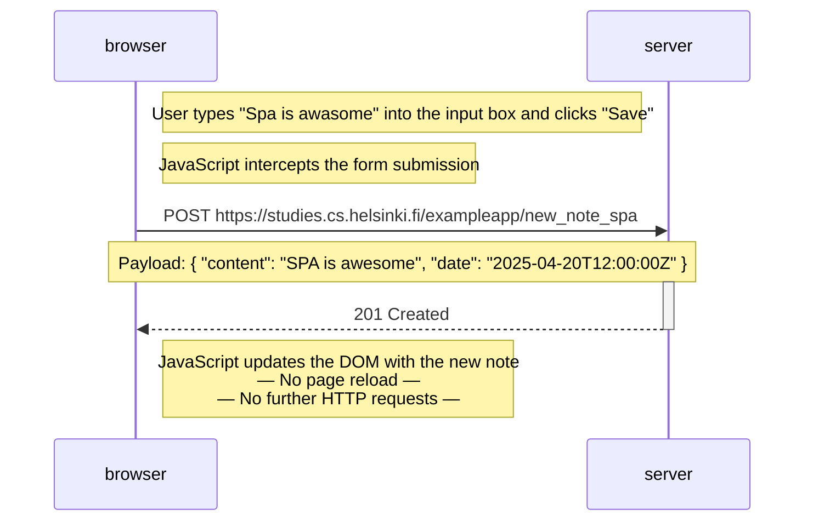

```mermaid
sequenceDiagram
    participant browser
    participant server

    Note right of browser: User types "Spa is awasome" into the input box and clicks "Save"
    Note right of browser: JavaScript intercepts the form submission

    browser->>server: POST https://studies.cs.helsinki.fi/exampleapp/new_note_spa
    Note over browser,server: Payload: { "content": "SPA is awesome", "date": "2025-04-20T12:00:00Z" }
    activate server
    server-->>browser: 201 Created
    deactivate server

    Note right of browser: JavaScript updates the DOM with the new note<br>— No page reload —<br>— No further HTTP requests —

```

